# Webshop
Competence project for university classes


## Requirements
Webshop works with Django 2.2.7. Was tested with Python 3.7 and 3.8

## Technologies
Mainly Django, Bootstrap and PostgreSQL.

## Features

* Registering and logging in using Facebook account or traditional way

* Using email for sending activation email

* Cart, making orders and shopping history

* Coupons decreasing order's price and sales decreasing product's price

* Generating pdfs with receipts

* Newsletter

* Payments with Paypal

* Writing complainments

* Orders and complainments managment, money refunds

* Products reviews

* Best, similar and recent products section

* Custom parameters for products depending on categories

* Searchnig products by their name


## Running server
After running server application will be available in your browser under this URL: http://127.0.0.1:8000/
```bash
python3 manage.py runserver
```

## Virtual environment
MacOS/Linux
```bash
source project/bin/activate
```
Windows
```shell
project/Scripts/activate
```

## Preview

You can display every currently available product in the shop...
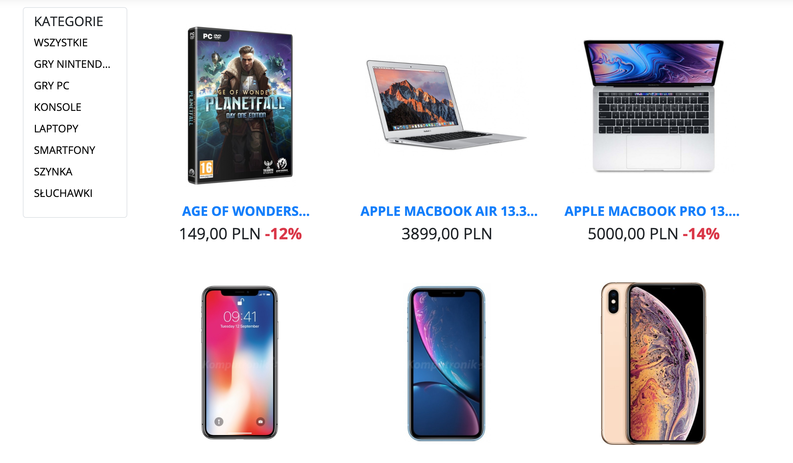

...Or you can watch products filtered by categories 
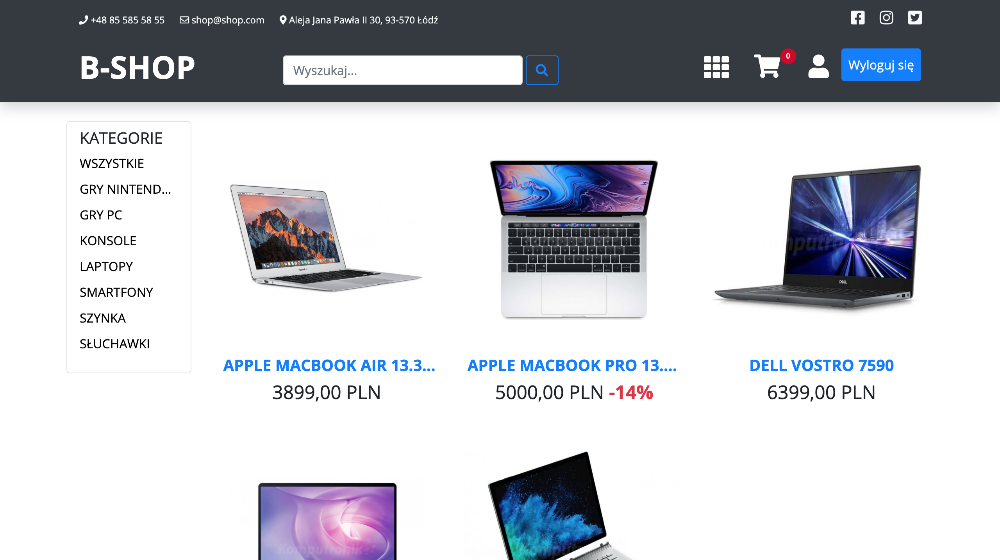

If your product database gets really big - don't worry about long loading time. There's pagination!
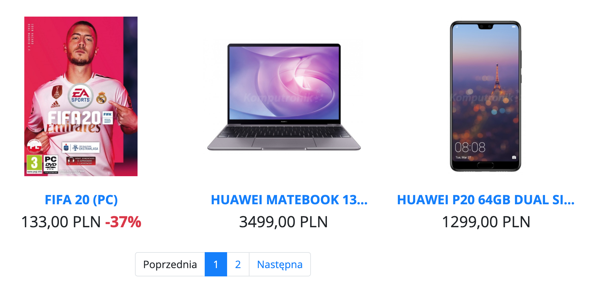

We really cared to show every detail about products to users, so you can zoom in photos. Every product may contain as many photos as you want
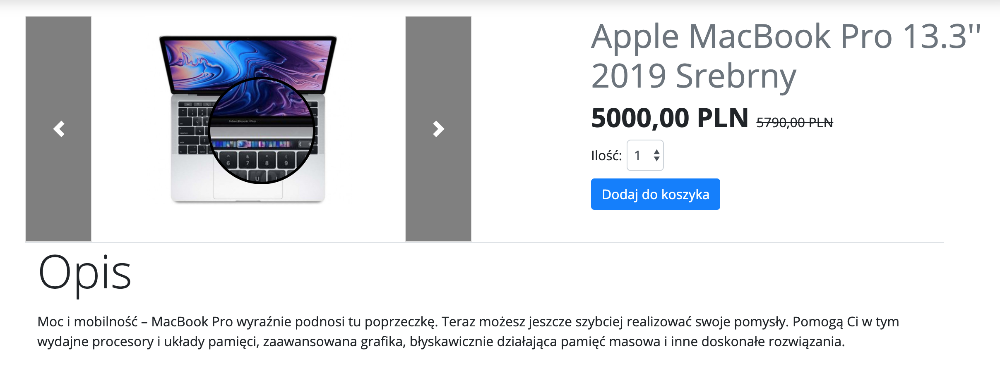

Short description is not enough to encourage customer, so we also provide clear tables with specification. Depending on what product you sell - you can customize it. For example if you sell laptops, you can add information about OS, processor or RAM, but if you sell clothes, you can fill the table with information about color or material
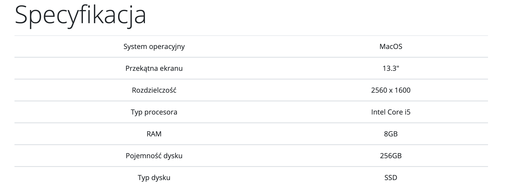

You didn't find the product you like? There are sections with similar and recommended products, to help you find more interesting options
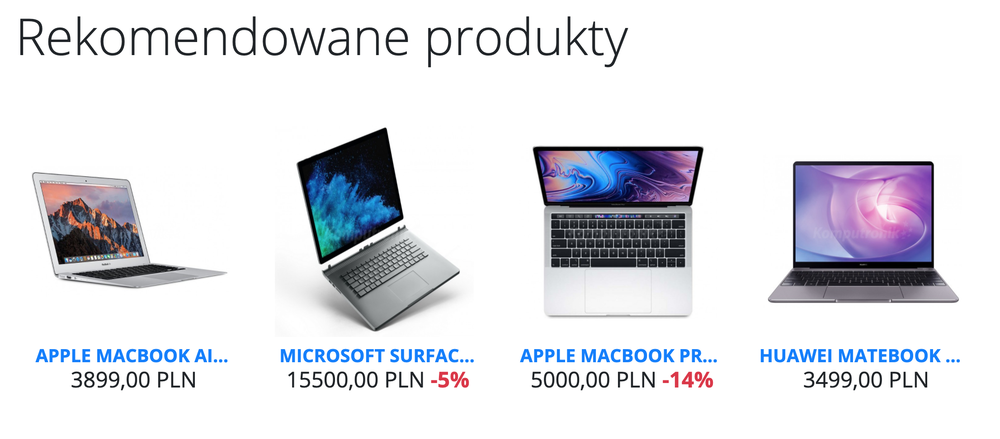

There's also a section with recently viewed products
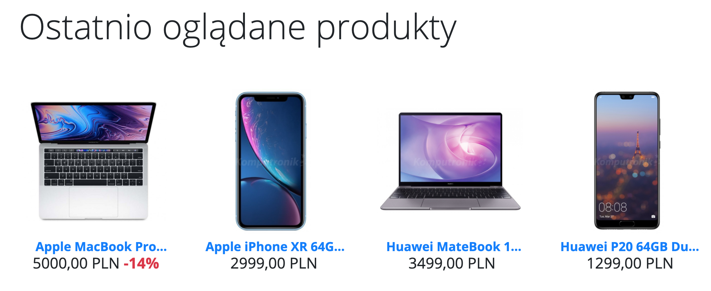

If you aren't sure about purchasing a product - read some reviews. You can also add one.
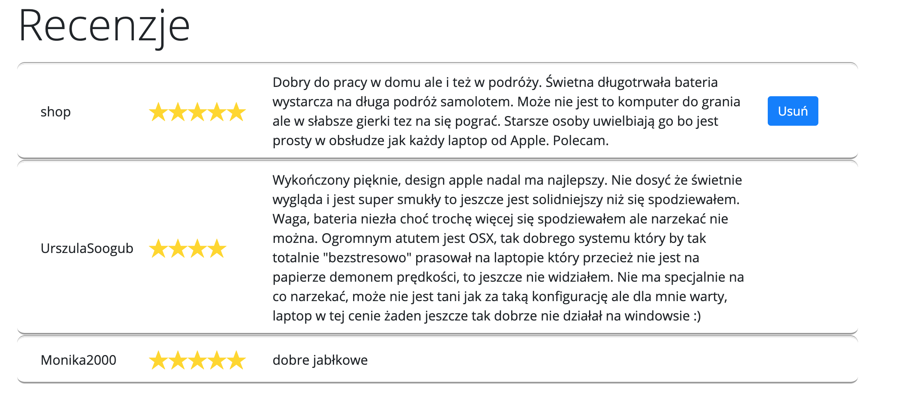

After you choose the products you like, you can find them in the shopping cart. If you have a special code - you can get a discount!


Choose from many delivery options
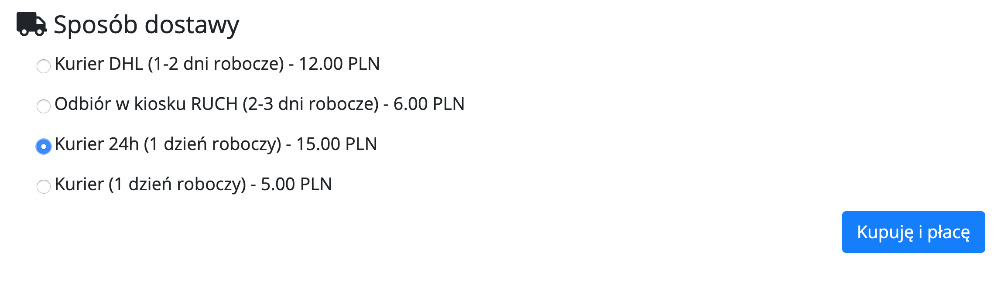

Pay safely for Paypal. If you won't be satisfied - our staff may validate your complaiment and then give you refund
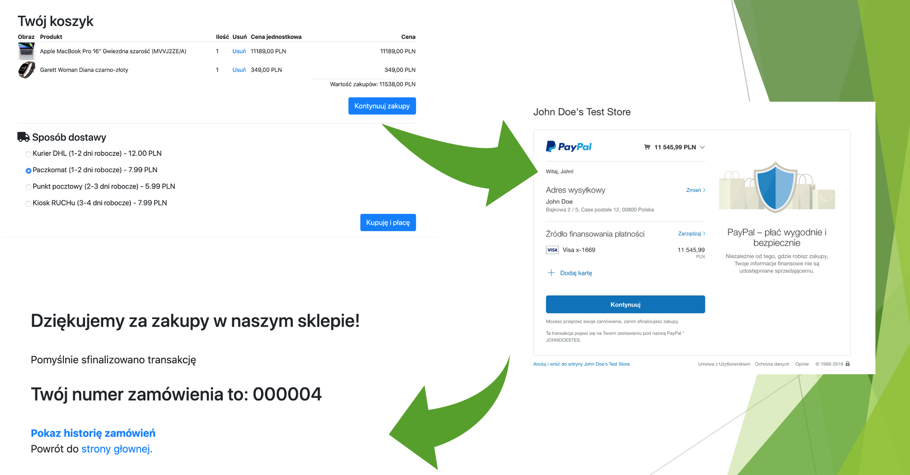

Did I mention staff? Yes, our application also has a subpage for staff members, so they can provide to customers details about their order's state
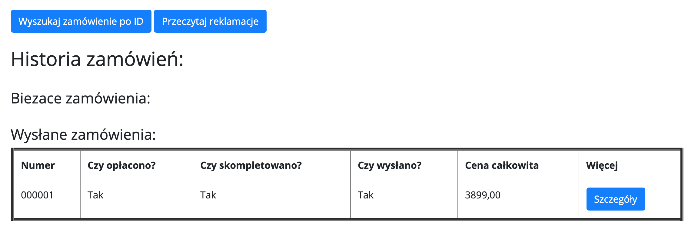

If you buy something - wait for an e-mail with pdf containing receipt
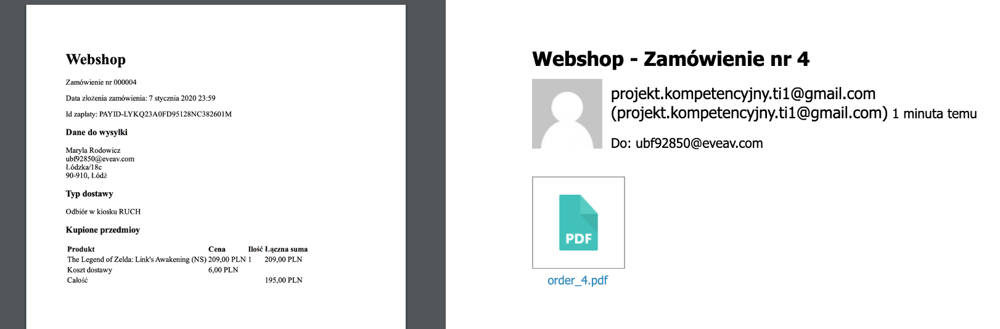

Yes, we also support newsletters and registration links for new accounts
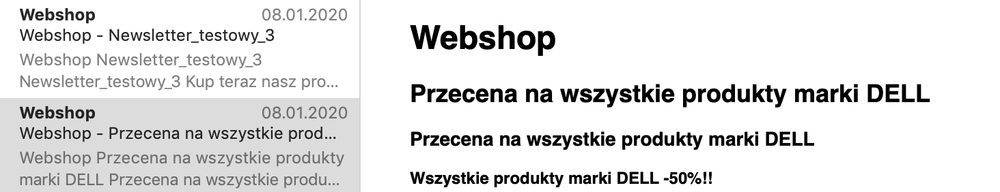

You can create an account in traditional way, but you can also use your Facebook account
<br>

This website also looks good on mobile devices!
 
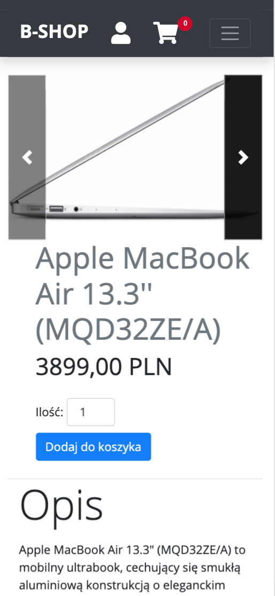


## Credits
Project was created for competence project on Politechnika Łódzka by four people team:
* Urszula Sołogub - Backend developer, Team leader
* Daria Lasecka - Backend developer
* Patryk Mazurek - Frontend developer
* Grzegorz Nalepa - Frontend developer